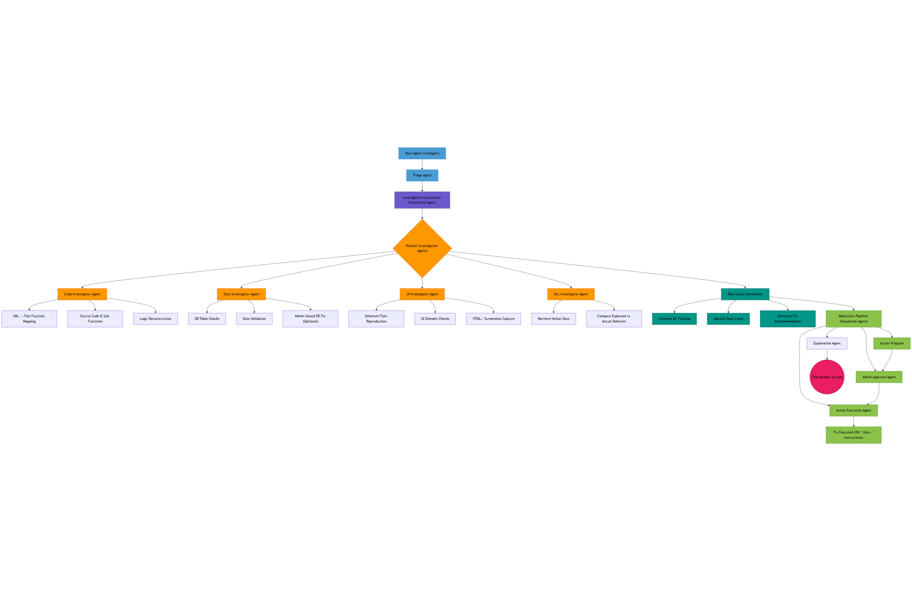

# DevTools

DevTools is a **source-available project** built with Google’s **ADK Framework** and sample tools.  
It is designed to help with debugging, automation, and orchestration of developer workflows.

---

## 📜 Licensing

This project is licensed under the **Business Source License 1.1 (BSL)**.

- ✅ Free for personal, educational, research, and **internal company use**  
- ❌ Not allowed for **commercial resale, SaaS, or subscription-based products** without a commercial license  
- 🔄 After 3 years, this license will convert to **Apache-2.0** (or another license chosen by the Licensor)  

⚠️ The Licensor (Jonathan Chacko / jcp-tech) reserves the right to relicense this project under different terms in the future.

👉 For commercial licensing inquiries, please contact:  
**Jonathan Chacko (jcp-tech)**  
📧 jonathanchacko1805@gmail.com  
🌐 [jcp-tech.web.app](https://jcp-tech.web.app/)  
🔗 [LinkedIn](https://www.linkedin.com/in/jcp-tech/)  
💻 [GitHub](https://github.com/jcp-tech/)

> Note: The project name may change in future releases. Current name is **DevTools**.

---

## 📢 Updates

🔗 [Read my LinkedIn Post about DevTools](https://www.linkedin.com/feed/update/urn:li:share:7368415904369405952)

---

## 🚀 Features

> **Note:** Built on **ADK (Agent Development Kit)**, focused on debugging a **Django + MySQL system**.

## 1) Purpose

Help users debug issues by providing details (screenshots, Django yellow error pages, HTML, images, or free‑form descriptions). The AI agent will understand the problem and follow a standard, step‑by‑step debugging procedure, delegating tasks to sub‑agents/tools as needed.

## 2) Scope (Current)

- **Agentic Framework:** ADK (core orchestration layer)
- **Target Framework for Debugging:** Django
- **Database:** MySQL
- **Context Inputs:**

  - Screenshots
  - Yellow error page text (raw HTML, image, or plain text)
  - Free‑form problem details
  - Links/URLs inside the app (when available)

## 3) Debugging Workflow (Existing)

1. **If a link is provided:**

   - Extract file/function location from the link.
2. **If file or function path is known:**

   - Read the function docstring (`__doc__`) first, then the full function code.
   - If sub‑functions are referenced inside, read them too and understand their behavior.
   - Use this to reconstruct the logic of the function for deeper understanding.
3. **Use database models when relevant:**

   - Understand what data enters the function and where it goes.
4. **Understand the data flow:**

   - Rely on any available documentation (acknowledging it may be limited).

## 4) Tools (Existing)

- **ADK as Orchestration Layer**

  - Hosts the agent network; coordinates sub‑agents and tool calls.
- **GenAI Toolkit Toolbox**

  - Connect to **MySQL** (initially **read‑only**; later, controlled write access will be enabled after verification).
- **Custom‑Built Tool (to be converted to ADK’s MCP Server)**

  - Lists the different links in the system.
  - Given a link for debugging, returns key details (URL, file path, name, etc.) with schema guaranteed for locating the code.
- **File/Function Reading Tools**

  - Via **GitHub MCP** and/or a **custom code‑parsing tool** (both may be used; GitHub MCP is ideal but limited on alternate branches).

## 5) Assumptions & Constraints (As Stated)

- System documentation exists but is limited.
- The agent should prioritize understanding function logic and data flow from real code and models.
- MySQL: start with **read‑only access**. Controlled writes added later once reliability is proven.
- The ADK agent network is separate from Django, with only database + tool permissions for debugging.
- Links inspector guarantees correct schema for locating code.

## 6) Supporting Context (New)

- **Notion Documentation** will be provided, containing scenarios, problems, and mitigation strategies. This gives the agent context on system logic and expected flows.
- **Agentic Pipelines in ADK:** ADK will orchestrate multiple specialized agents working together in a pipeline.
- **Audit Trail (Future To‑Do):** Logging every debugging step is **very important**, but will be added after the system stabilizes.

## 7) Current Status Summary

- Planning a multi‑agent debugging flow using ADK as the orchestration framework.
- Flow starts from user-provided artifacts (links, error pages, screenshots, text) and drills into code, sub‑functions, and models to map data flow and logic.
- Tooling to resolve links → code locations and to read code is in scope.
- MySQL connectivity via GenAI toolkit is in scope (read‑only first).
- Notion docs and audit trail are part of the future roadmap.

---

## 🤝 Contributing

We welcome contributions! See [CONTRIBUTING.md](./CONTRIBUTING.md) for guidelines.

---

## ⚖️ Legal Attribution

- **Licensor:** Jonathan Chacko (jcp-tech)  
- **Licensed Work:** DevTools  
- License: **BSL 1.1**, with conversion to **Apache-2.0** on the Change Date

### Pipeline Diagram

<!-- [![](https://mermaid.ink/img/pako:eNqNVt1yozYYfRUNO9txZkhijO1gd9oZGXCCgw0DOG1a90LBis0EkFdANtlMbvsAfcQ-ST8BxsTNZpYbkDjn-9P5JL1IIVtTaSzdx-xruCU8R4GxSlcpgufzZ_SLeJDu2I6H_ODWNn3UwbaNAvP3AE1srF-fVJiKEcYkywx6jzhjObqP4nj8qT8Z6YYqZzlnD3T8STE1zRzIIYsZH9_FJHz4-Yib0S81dYgHWDcaal9TDW3yEXVHOIljGtf86XSkdbsN35wOdRh-5Po5zbc1udsdDTWtIXe7w9FA_4hMwjxiac3WJrraxw17MNAmvelH7PsoJfu4zZFiDg8lw4bSH1wckZsl8hwnqAb4z5XkicLjDU1z1LHjpPw6WUl_odPTX9EEAAGPyIZWEJhvGQo8C1-a1XBS4nXAW-kjzfJoQ8rkdMb4GiLNGUcdn34pwEoEcTd-WvZ0x_EMa4EDoR3XtgIfWYvAQS72QEImiMgD_fgVXi8dGi8ryd2v4VvPpYdsJb22PDSWJh5e6FdmbcsobZkKRK-DuluGIOpD4i1oD6AGyckPQFWALq0fAPaFTRZ-D9kqk2FCYW5MP7AucWA5i-qXqZR2piKNpWejf__-B02jmJ5Pi7RS2pzsdlG6aRzvGSIbnxU8pKjM_yfkF3ene1r2P7xIyWabKEQeDQGQ86JEvo3TwAF-N85eaeVSxGlMUEDuYvC7peFDy1ONaep8Q-JoTRonbYyIBq-TKD29JDldI7A5jZ5Qx9kJOImPVCbW4p2g1NLYlQjKpzFNoyJBU9jjIMUdZ-tWgm14r1pcM6aJ6KDjLGqUiPAqmNvoHPkhpzTNttB0OtnlBadHRXP0d8Prl5YsEZ5Hcx7RR4oWrFxV0EzLZQ3slVpOYH-jyHza0VBU5jFDOMwLaL8J3ZLHiPG3zv3bRQBNYb1pi9l-k9BJkVHkix2PZtE3yhunswpY9U9yF6WwXcQxrEIKrb_JjnEiNmstNoL7Z3QwfQwTVbukKeWwquWKCrElUOeWDg6bmuk79lIUDLmWa9rWwmwbuy7rlrG4KEvmRjsaizC_syUJ4nVJtEVSuGofl7Mdy1p515DeXoAI70Arj3tbxzj1YMp8omFx2Kbe5oKNubVA2HU95wbbaGo7v1X_bKV2WA97td16WKltDl5EtSoXsOodaIjzUiXwsg7dmh01xhS2Xhs5y8BdBu24F2AQJBSTlBxFLDCLEuN0OsKrOJFwmn2lHOUMLctanZy0U3Nd-7a6Hvit8wxheVJeAdpzujjY2xOGbCqy2ZNNVQaZ74_uNmImzxR51pNnanUyt_9dy7Yi2z3ZVuV5ffS2fzvVgbpKJVna8GgtjaFOVJYSyhMihtKLgK8kUH8CWh3DZxxttlCJVfoKpB1J_2As2fM4KzZbaXxP4gxGxQ5ESw04STlJmlkOWqZcZ0WaS2NlCFcNYUUav0hP0vhUgZmzkTZS-n1VUfsXA1l6hukL7WygakoX7hcavJTBqyx9Kx0rZ6MLTVPhHjJSugNNBQJdR3CKzKsrW3lze_0Px_nnzw?type=png)](https://mermaid.live/edit#pako:eNqNVt1yozYYfRUNO9txZkhijO1gd9oZGXCCgw0DOG1a90LBis0EkFdANtlMbvsAfcQ-ST8BxsTNZpYbkDjn-9P5JL1IIVtTaSzdx-xruCU8R4GxSlcpgufzZ_SLeJDu2I6H_ODWNn3UwbaNAvP3AE1srF-fVJiKEcYkywx6jzhjObqP4nj8qT8Z6YYqZzlnD3T8STE1zRzIIYsZH9_FJHz4-Yib0S81dYgHWDcaal9TDW3yEXVHOIljGtf86XSkdbsN35wOdRh-5Po5zbc1udsdDTWtIXe7w9FA_4hMwjxiac3WJrraxw17MNAmvelH7PsoJfu4zZFiDg8lw4bSH1wckZsl8hwnqAb4z5XkicLjDU1z1LHjpPw6WUl_odPTX9EEAAGPyIZWEJhvGQo8C1-a1XBS4nXAW-kjzfJoQ8rkdMb4GiLNGUcdn34pwEoEcTd-WvZ0x_EMa4EDoR3XtgIfWYvAQS72QEImiMgD_fgVXi8dGi8ryd2v4VvPpYdsJb22PDSWJh5e6FdmbcsobZkKRK-DuluGIOpD4i1oD6AGyckPQFWALq0fAPaFTRZ-D9kqk2FCYW5MP7AucWA5i-qXqZR2piKNpWejf__-B02jmJ5Pi7RS2pzsdlG6aRzvGSIbnxU8pKjM_yfkF3ene1r2P7xIyWabKEQeDQGQ86JEvo3TwAF-N85eaeVSxGlMUEDuYvC7peFDy1ONaep8Q-JoTRonbYyIBq-TKD29JDldI7A5jZ5Qx9kJOImPVCbW4p2g1NLYlQjKpzFNoyJBU9jjIMUdZ-tWgm14r1pcM6aJ6KDjLGqUiPAqmNvoHPkhpzTNttB0OtnlBadHRXP0d8Prl5YsEZ5Hcx7RR4oWrFxV0EzLZQ3slVpOYH-jyHza0VBU5jFDOMwLaL8J3ZLHiPG3zv3bRQBNYb1pi9l-k9BJkVHkix2PZtE3yhunswpY9U9yF6WwXcQxrEIKrb_JjnEiNmstNoL7Z3QwfQwTVbukKeWwquWKCrElUOeWDg6bmuk79lIUDLmWa9rWwmwbuy7rlrG4KEvmRjsaizC_syUJ4nVJtEVSuGofl7Mdy1p515DeXoAI70Arj3tbxzj1YMp8omFx2Kbe5oKNubVA2HU95wbbaGo7v1X_bKV2WA97td16WKltDl5EtSoXsOodaIjzUiXwsg7dmh01xhS2Xhs5y8BdBu24F2AQJBSTlBxFLDCLEuN0OsKrOJFwmn2lHOUMLctanZy0U3Nd-7a6Hvit8wxheVJeAdpzujjY2xOGbCqy2ZNNVQaZ74_uNmImzxR51pNnanUyt_9dy7Yi2z3ZVuV5ffS2fzvVgbpKJVna8GgtjaFOVJYSyhMihtKLgK8kUH8CWh3DZxxttlCJVfoKpB1J_2As2fM4KzZbaXxP4gxGxQ5ESw04STlJmlkOWqZcZ0WaS2NlCFcNYUUav0hP0vhUgZmzkTZS-n1VUfsXA1l6hukL7WygakoX7hcavJTBqyx9Kx0rZ6MLTVPhHjJSugNNBQJdR3CKzKsrW3lze_0Px_nnzw) -->
Figure: ADK agent pipeline architecture.

> uvicorn UI.main:app --reload --host 127.0.0.1 --port 8501
